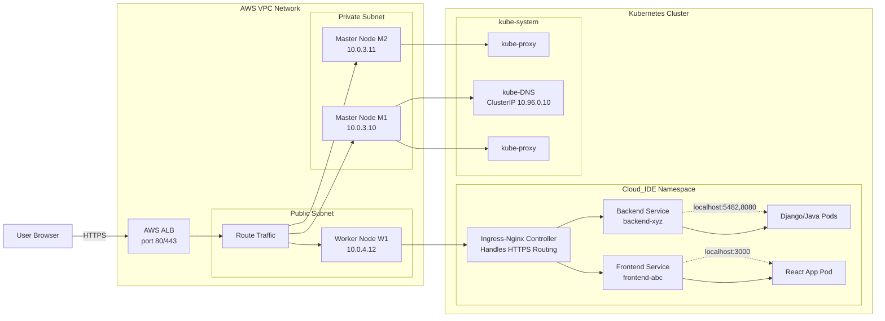

# Scalable_Cloud_IDE

The high-level system workflow is outlined below.

```mermaid

graph LR
    %% ========== Entry ========== 
    A[User Browser] -->|HTTPS| B[AWS ALB<br/>port 80/443]
    
    %% ========== AWS VPC ========== 
    subgraph VPC["AWS VPC Network"]
        B --> C[Route Traffic]
        
        subgraph PublicSubnet["Public Subnet"]
            C --> WN1[Worker Node W1<br/>10.0.4.12]
        end
        
        subgraph PrivateSubnet["Private Subnet"]
            C --> MN1[Master Node M1<br/>10.0.3.10]
            C --> MN2[Master Node M2<br/>10.0.3.11]
        end
    end
    
    %% ========== Kubernetes Cluster ========== 
    subgraph Kubernetes["Kubernetes Cluster"]
        WN1 --> IN[Ingress-Nginx Controller<br/>Handles HTTPS Routing]
        
        subgraph CloudIDE["Cloud_IDE Namespace"]
            IN --> S1[Frontend Service<br/>frontend-abc]
            IN --> S2[Backend Service<br/>backend-xyz]
            S1 --> P1[React App Pod]
            S2 --> P2[Django/Java Pods]
        end
        
        %% Kube System
        subgraph KubeSystem["kube-system"]
            MN1 --> KP1[kube-proxy]
            MN2 --> KP2[kube-proxy]
            MN1 --> DNS[kube-DNS<br/>ClusterIP 10.96.0.10]
        end
    end


    
    %% ========== Localhost Ports ========== 
    S1 -.->|localhost:3000| P1
    S2 -.->|localhost:5482,8080| P2

```
